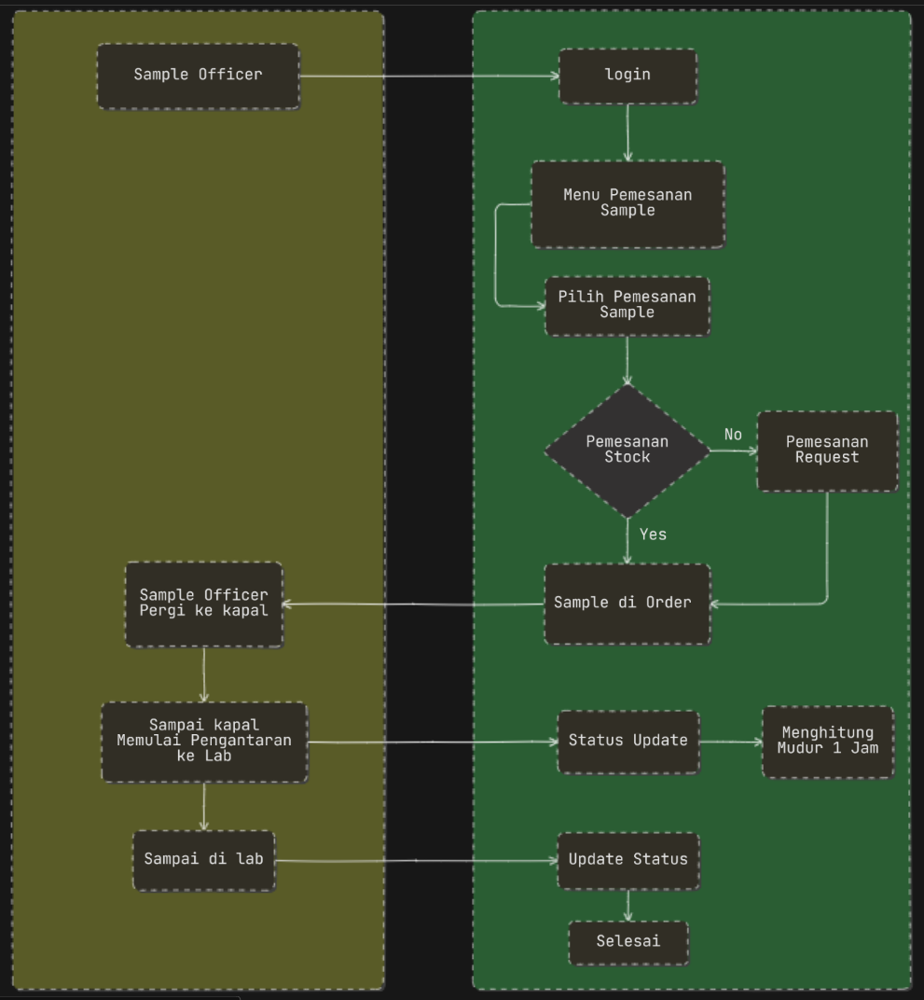

# Product Requirement Document (PRD)

Date: July 29, 2025 → August 16, 2025
Assign: Sedry iqbal
Status: In progress

# **Product Requirements Document - GO SAMPLE**

by DPPU Pertamina Aviation Soekarno Hatta (SHAFTI)

- **Nama Produk:** Go Sample
- **Tanggal:** 13-07-2025
- **Penulis:** Sedry Muhammad Iqbal
- **Versi:** 1.0

### **LATAR BELAKANG & TUJUAN**

**Permasalahan:**

- Sistem pengambilan sampel dari kapal impor di Pertamina Aviation Soekarno-Hatta saat ini masih menggunakan komunikasi yang terpisah antar bagian, seperti antara pemesanan sampel, laboratorium, dan proses komparasi. Hal ini menyulitkan dalam memantau status dan lokasi sampel secara real-time.

**Solusi:**

- Untuk mengatasi permasalahan tersebut, dikembangkan aplikasi **Go Sample**. Aplikasi ini berfungsi untuk mengintegrasikan komunikasi antar pihak yang terlibat, yaitu bagian pemesanan sampel, laboratorium, dan komparasi. Dengan Go Sample, proses pemantauan, pengelolaan, dan pelacakan posisi sampel dapat dilakukan dengan lebih efisien dan transparan.

**Tujuan**

- Go sample bertujuan untuk monitoring Sample dengan alur Pemesanan, Pengantaran, Pengujian dan Hasil Lab, lalu di lakukan Komparasi Sample. Hasil sample dinyatakan Release akan di lanjutkan ke muatan kapal Import agar bisa melakukan Pembokaran.
- Note : Apabila Sampel belum masuk nilai komparasi , maka akan dilakukan pengujian ulang (repeat) pada sampel tersebut.

### Teknologi

- Frontend : React JS
- Backend : Microsoft .Net
- Database: SQL Server

### Target Pengguna

- Karyawan Pertamina
    - Sample Officer
    - Supervisor
    - Head
- Karyawan Lab

### FLOW

Aplikasi **Go Sample** dirancang untuk mengelola alur pengambilan, pengantaran, pengujian, dan komparasi sampel dari kapal impor secara terintegrasi.

1. **Pemesanan Sampel**: Sample Officer memesan sampel dari kapal impor melalui aplikasi.
2. **Pengantaran Sampel**: Sampel diambil dan diantarkan ke laboratorium untuk pengujian.
3. **Pengujian di Laboratorium**: Laboratorium melakukan pengujian terhadap sampel dan mencatat hasilnya.
4. Product Quality Check Compartement Tanker: Input Data Product Quality Check Compartement Tanker oleh sample officer lalu melakukan perhitungan dan generate PDf 
5. **Komparasi Hasil**: Hasil pengujian dibandingkan dengan standar. Jika memenuhi, sampel dinyatakan **Release** untuk pembongkaran muatan kapal. Jika tidak, dilakukan pengujian ulang (repeat).
6. **Pemantauan Real-Time**: Semua pihak (Sample Officer, Supervisor, Head, dan Karyawan Lab) dapat memantau status dan lokasi sampel secara real-time.
7. **Stock Opname Sample**: Sistem mencatat dan melacak inventaris sampel.
8. **Pelaporan dan Notifikasi**: Sistem memberikan laporan hasil dan notifikasi kepada pihak terkait untuk tindakan lanjut.

---

### **FITUR UTAMA**

| **Nama Fitur** | **Deskripsi**  |
| --- | --- |
| Login | Masuk ke aplikasi Go Sample |
| Management User  | Menambahkan user dan mengatur Role sesuai kebutuhan |
| Dashboard | - Display Kalender menampilkan estimasi ada stock atau tidak
- Total Pengujian Lab
- Total yang sudah di uji 
- Pengujian 7 hari kebelakang (Line Chart) Berhasil & Gagal
- Total Pengujian Berhasil & Gagal (Pie Chart) |
| Management Stock, Management Kategori & Management Kapal  | Menampilkan data Stock, Menambahkan data stock , Kategori, dan Kapal |
| Management Laboratorium | Menampilkan data Lab, Menambahkan data Lab dan Asal 
Kota |
| Pemesanan Sampel, 
Pemesanan Stock, Pemesanan Request | Melakukan permintaan pengambilan sample ke kapal import / Local untuk di kirimkan ke lab dan seterusnya. 

Ada 2 Pemesanan Sample 
- Pemesanan Stock
Mengambil sample dari stock kalender

- Pemesanan Request
Input langsung data sample yang ada

Lokasi lab _+ Estimasi Waktu
`LPUJ -> Priok --> 1 jam
Lemigas --> Jakarta --> 1 Jam,
Balongan --> Balongan --> 6 Jam,`  |
| Pengujian & Analisa Hasil Lab+ | Mengelola Sample yang di terima, melakukan Pengujian & Analisa Sample lalu Verifikasi & menerbitkan Dokument  
6 jam  |
| Komparasi Dokumen Sample+ | Generate PDF Data Product Quality Check Compartement Tanker setelah sample officer input data dan melakukan perhitungan, di lanjutkan ke Komparasi data lab untuk mendapat Hasil Komparasi OnSpec, Sampel dinyatakan release dan Muatan Kapal Import bisa dilakukan pembongkaran. |
|  |  |

## Flowachart Go Sample

- Pemesanan Sample

- Pengujian Lab

Komparasi Dokument Sample

## WIRE FRAME

[https://wireframe.cc/pro/ppp/4d5377733-966564](https://wireframe.cc/pro/ppp/4d5377733-966564)

# Go Sample Application Flow

## 1. Gambaran Besar (High-Level Flow)

Aplikasi **Go Sample** mengintegrasikan pengelolaan sampel dari kapal impor secara efisien dengan pelacakan real-time. Alur utama meliputi:

1. **Pemesanan Sampel**: Sample Officer membuat pemesanan sampel tanpa validasi Supervisor.
2. **Pengambilan dan Pengantaran Sampel**: Sample Officer memilih pemesanan, mengonfirmasi pengambilan, mengantarkan sampel ke lab dalam waktu estimasi (countdown), dan memperbarui status (misalnya: macet).
3. **Pengujian di Laboratorium**: Karyawan Lab melakukan pengujian, mencatat hasil, dan memperbarui status pengujian tanpa validasi Supervisor.
4. **Product Quality Check Compartement Tanker**: Input Data Product Quality Check Compartement Tanker oleh sample officer lalu melakukan perhitungan dan generate PDf 
5. **Komparasi Hasil**: Sistem membandingkan hasil dengan standar, memperbarui status komparasi, dan menentukan **Release** atau **Repeat**.
6. **Stock Opname Sample**: Melacak inventaris sampel di laboratorium.
7. **Pemantauan Real-Time**: Memantau status, lokasi sampel, dan stok secara real-time.
8. **Pelaporan dan Notifikasi**: Laporan status sampel/stok dan notifikasi otomatis.

## 2. Flow Level 1 (Proses Utama)

1. **Modul Pemesanan Sampel**:
    - Sample Officer membuat pemesanan tanpa validasi Supervisor.
2. **Modul Pengambilan dan Pengantaran Sampel**:
    - Sample Officer memilih pemesanan, mengonfirmasi pengambilan, mengantarkan sampel, dan memperbarui status pengantaran.
    - Pelacakan lokasi dan countdown.
3. **Modul Pengujian Laboratorium**:
    - Karyawan Lab mencatat hasil dan status pengujian.
4. **Modul Komparasi**:
    - Sistem membandingkan hasil, memperbarui status, dan menentukan **Release** atau **Repeat**.
5. **Modul Stock Opname Sample**:
    - Melacak dan memperbarui stok sampel.
6. **Modul Pemantauan dan Pelaporan**:
    - Dashboard real-time dan notifikasi otomatis.

## 3. Flow Level 2 (Sub-Proses dalam Setiap Modul)

### Modul 1: Pemesanan Sampel

- **Input Pemesanan**:
    - Sample Officer login ke aplikasi.
    - Mengisi form: ID kapal, jenis sampel, jumlah, waktu pengambilan.
    - Pemesanan disimpan tanpa validasi Supervisor.
- **Notifikasi**:
    - Notifikasi ke Sample Officer bahwa pemesanan tersedia di dashboard.

### Modul 2: Pengambilan dan Pengantaran Sampel

- **Pemilihan Pemesanan**:
    - Sample Officer melihat daftar pemesanan di dashboard (list/card).
    - Mengonfirmasi pengambilan sampel.
- **Pengambilan Sampel**:
    - Sistem menetapkan waktu estimasi pengantaran (countdown).
    - Sample Officer mengambil sampel dan memperbarui status (“Sampel Diambil”).
- **Pengantaran ke Lab**:
    - Sample Officer mengantarkan sampel.
    - Memperbarui status, misalnya: “Dalam Perjalanan”, “Macet di Lokasi X”, “Terkendala Cuaca”.
    - Sistem melacak lokasi dan menampilkan countdown timer.
- **Konfirmasi Penerimaan**:
    - Karyawan Lab mengonfirmasi penerimaan sampel.

### Modul 3: Pengujian Laboratorium

- **Penerimaan Sampel**:
    - Karyawan Lab memindai kode sampel untuk registrasi.
    - Sistem mencatat waktu penerimaan dan memperbarui stok.
- **Pengujian**:
    - Karyawan Lab memasukkan hasil pengujian (kadar air, viskositas).
    - Memperbarui status, misalnya: “Sedang Diuji di Alat X”, “Menunggu Ketersediaan Alat”, “Pengujian Selesai”.
    - Hasil disimpan tanpa validasi Supervisor.
- **Pembaruan Stok**:
    - Sampel diuji diperbarui di stock opname (“Sampel Digunakan” atau “Sampel Sisa”).

### Modul 4: Komparasi

- **Perbandingan Hasil**:
    - Sistem membandingkan hasil pengujian dengan standar.
    - Memperbarui status, misalnya: “Sedang Dibandingkan”, “Menunggu Data Tambahan”, “Komparasi Selesai”.
    - Status sampel: **Release** atau **Repeat**.
- **Tindakan Lanjut**:
    - **Release**: Notifikasi untuk pembongkaran muatan.
    - **Repeat**: Pemesanan ulang ditambahkan ke dashboard Sample Officer.

### Modul 5: Stock Opname Sample

- **Pencatatan Stok**:
    - Sistem mencatat sampel yang diterima, diuji, dan sisa.
    - Karyawan Lab memperbarui stok (misalnya: sampel rusak, dikembalikan).
- **Laporan Stok**:
    - Dashboard menampilkan stok berdasarkan jenis dan status.
    - Notifikasi jika stok menipis.

### Modul 6: Pemantauan dan Pelaporan

- **Dashboard Real-Time**:
    - Menampilkan status pemesanan, pengantaran (termasuk macet), pengujian, komparasi, dan stok.
    - Filter berdasarkan kapal, tanggal, jenis sampel, atau status.
- **Notifikasi**:
    - Notifikasi otomatis untuk status seperti “Macet di Lokasi X”, “Pengujian Selesai”, “Sampel Release”.
    - Laporan harian/mingguan untuk Head, termasuk stok dan status.

Contoh input Request Google Form 

[https://docs.google.com/forms/d/e/1FAIpQLScA4R0-Ak1HBcDg5Nl6mL5FTkOgk37uO1csi24Wbr4wEtp-yw/viewform](https://docs.google.com/forms/d/e/1FAIpQLScA4R0-Ak1HBcDg5Nl6mL5FTkOgk37uO1csi24Wbr4wEtp-yw/viewform)

Untuk referensi ini masuknya ke tim lab,
mungkin saya bantu isi / kasih contoh ya bang.

Registrasi Sample External LPUJ
Contoh Pengisian

Tanggal : 05 Agustus 2025
Nomor Permintaan : 227/NPC/SKH/2025
Nama Kapal / Tangki : MT. Commodore One/T.107
Jumlah Sample : 4 Botol
Jenis Sampel : JET A-1
Perusahaan Pengirim Sampel : SHAFTHI
Nama Pengirim Sampel : Moch. Aby Gazal
Estimasi Kedatangan Sampel : 10:00 AM
Memo : Lampirkan/upload file
Foto : Lampirkan/upload file

Submit

Kurang Lebih seperti ini

Meeting 17 Agustus 2025
- detail total siring 
- destilian dropdown web baru 
- method dropdown  (penambahan method) pilihan 
- unit  (penambahan unit) pilihan bisa berubah