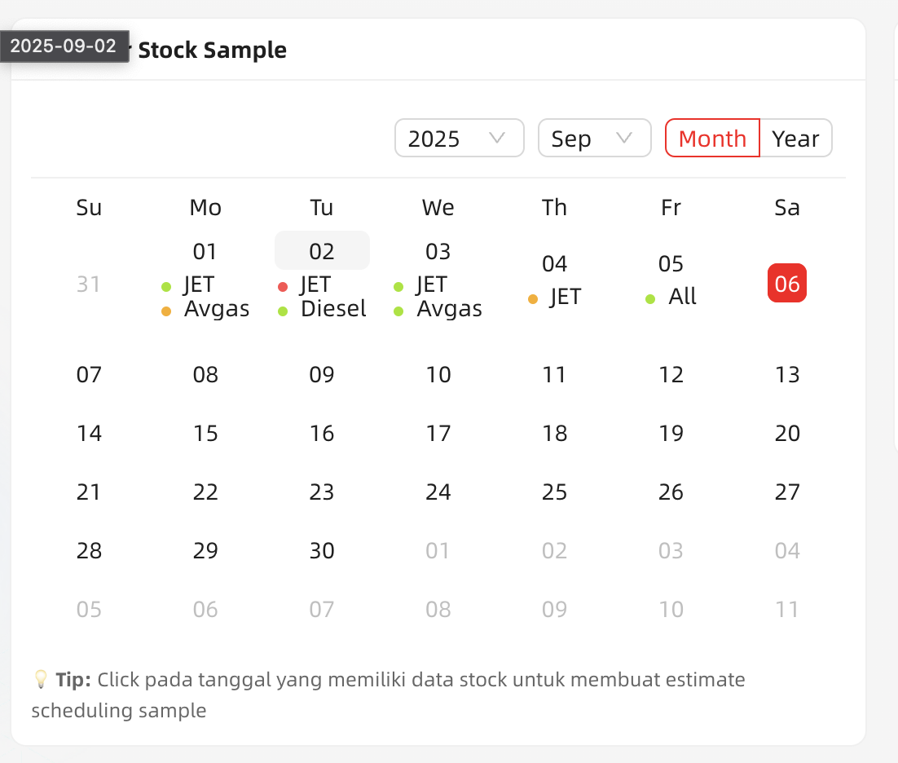
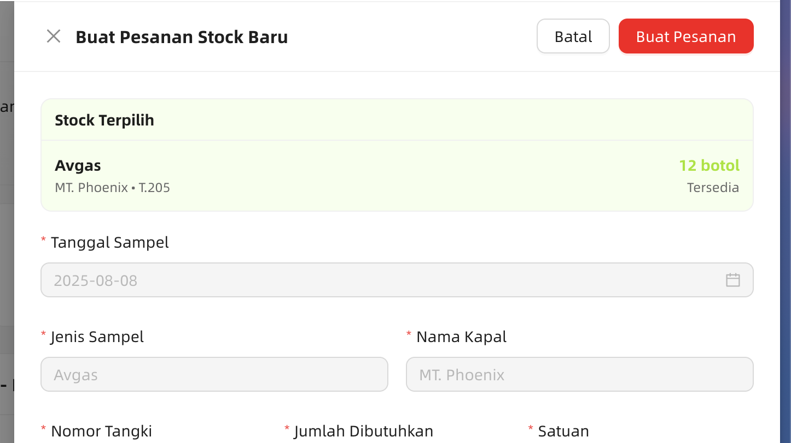
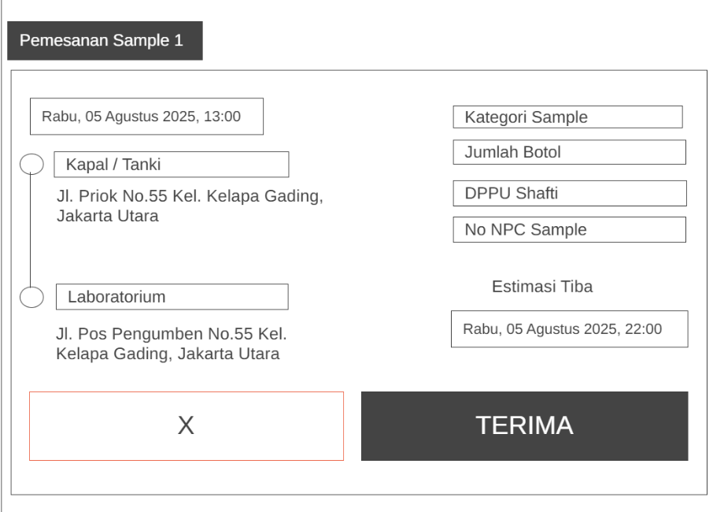
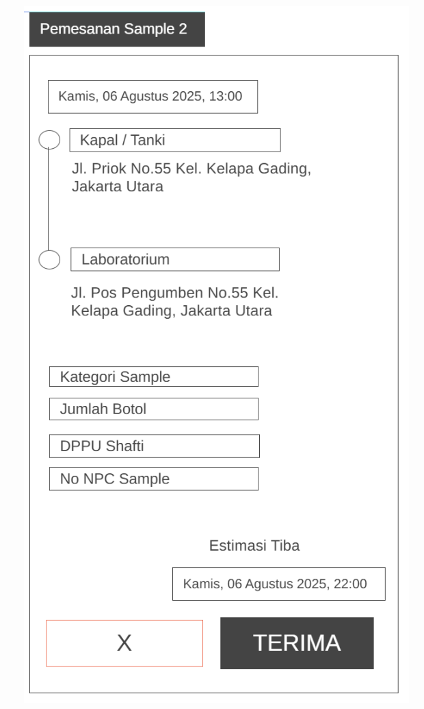
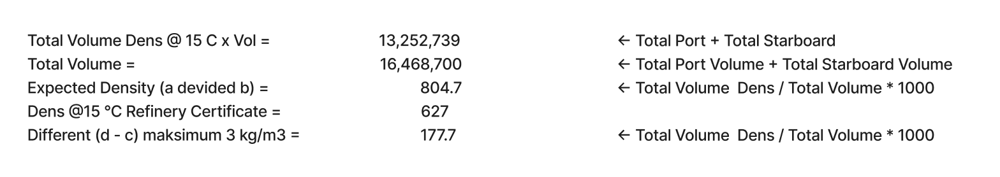
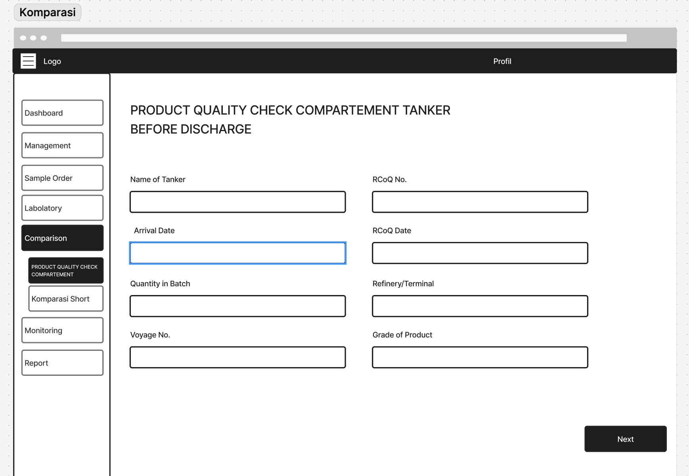
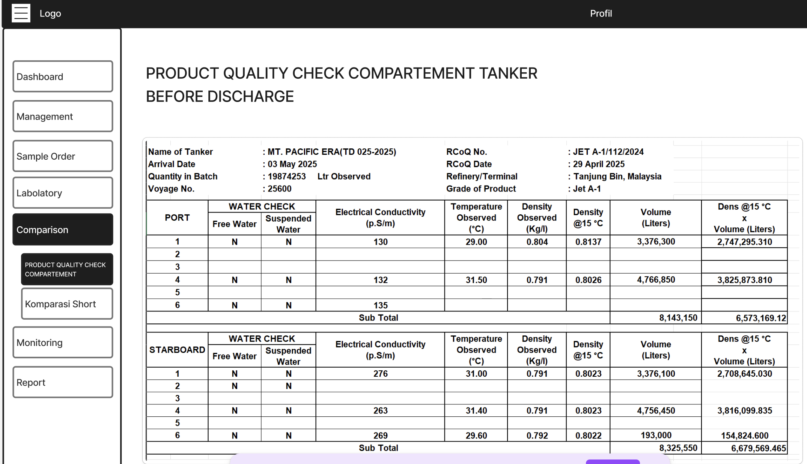
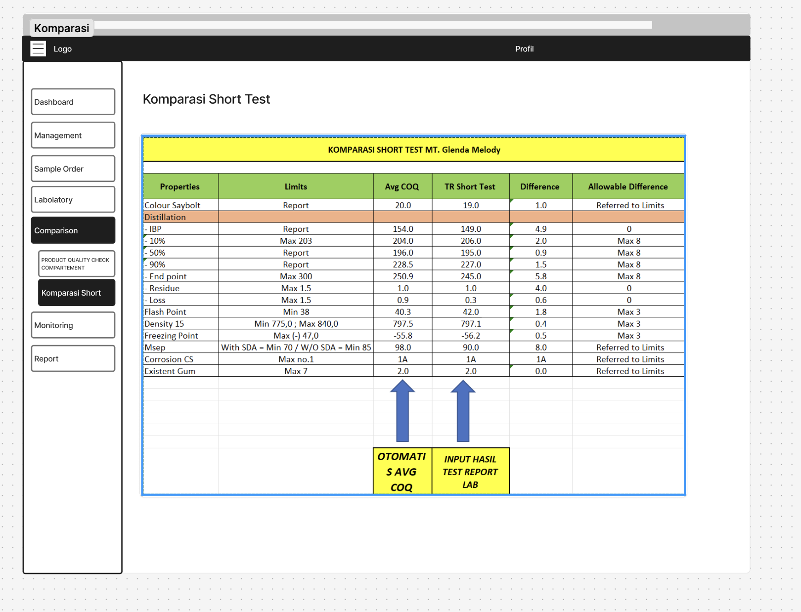

# FE: Sprint 2
**Update 1 September 2025**

Dashboard

- Pie chart Gagal di ubah Repeat (kata kata “gagal” di dalam aplikasi ini ketika testing sample diubah menjadi “repeat”)
- Dashboard view kalender ketika tanggal yang ada stock sample di klik maka redirect ke menu “create order sample”

Ship Management

- tambah kolom completed_time kapal (nanti di view calendar tampil juga di completed_time nya kapal)

Stock

- “Stock” di ubah menjadi “Sample”
- “Estimate Scheduling Sample” di ganti menjadi “Estimasi Sample”
- Status “Kritis” di ganti menjadi “Urgent”
- “Status Terpakai” di Form create estimate sample di Drop
- “Jenis Sample” ganti menjadi “Jenis Product”, dan value nya sementara diganti ini dulu :
    - JET-A1,
    - Avgas,
    - Soft blended
- Nomor tanki ubah jadi dropdown, sementara pakai value ini dulu :
    - Tangki 101
    - Tangki 102
    - [sampai dengan]
    - Tangki 110
    - Single tank composite
    - multi tank composite

Request & Order Stock → Sample Order

- Menu “Request & Order Stock” diganti menjadi “Sample Order”
    - “Request Stock” diganti menjadi “Create Request Order”
    - “Order Stock” diganti menjadi “Create Ready Order”
    - Kedua menu ini dijadikan satu, tidak ada lagi tabbing, list nya cuma satu, yang buat beda adalah ketika form create nya saja. jadi tetap ada 2 form create (Create Request Order, dan Create Ready Order). dan di list nanti ada 2 kategori yaitu “Ready” dan “Request”
- Dropdown Category Test, value nya sementara pakai ini :
    - Short Test
    - IBS
    - CoA
    - Soak Test
- Create Ready Order :
    - + kolom Nomor NPC (string)
    - Tanggal Sample diganti dengan Tanggal Order dan fillable (bukan disable mengikuti tanggal sample)
- Create Request Order :
    - Section Informasi Pengirim di drop
    - Nomor tanki ubah jadi dropdown, sementara pakai value ini dulu :
        - Tangki 101
        - Tangki 102
        - [sampai dengan]
        - Tangki 110
        - Single tank composite
        - multi tank composite
    - + kolom tanggal Order
    - + kolom Nomor NPC (string)
    - ship diubah jadi dropdown ship
    - Sample Officer di drop
- Desain Kolom Foto Sample dan Memo File antara Ready dan Request Order disamakan
- “Priority” Drop value Critical, menjadi hanya 2 yaitu (Normal dan Urgent)

Shipping [Modul Baru]

setelah dilakukan “**sample order**” oleh user instansi pertamina, kemudian dilakukan take order sample nya dengan tujuan mengambil stock di kapal lalu mengantarkan nya ke lab untuk di uji. untuk desain nya bisa

Ada 2 Section di menu ini.

Section 1 : List Pending Sample Order

- untuk desain card kurang lebih mengikuti gambar dibawah. itu adalah list order baru yang harus di take action shipping (seperti gojek , driver standby sampai ada order masuk) jadi sering kali juga di section ini orderan kosong. (versi web dan versi mobile)

Section 2 : History Order

- History Order: History order per user yang diambil. jadi list historical per user setiap dia take action shipping

Labroratorium

- Management Syringe
    - Kata “Sringe” diganti menjadi “Syringe”
    - Drop Aksi Cepat di dalam form update syringe
    - Drop Storage Kabinet 1,2,3 . cuma ada satu berdasarkan unit saja bukan per storage.
- List Action ketika di click
    - Konfirmasi Sample : (kurang konfirmasi sample) → jadi ini statusnya konfirmasi dulu setelah di terima oleh lab, lalu set estimasi waktu selesai pengujian
    - Muncul modal sidebar konfirmasi Sample Beserta TextBox Deskripsi & Input estimasi selesai
- Input hasil pengujian :
    - Distilation jadi satu dropdown dan ada child dalamnya ada ( IBP , 10%, 50%, dll ) mengikuti contoh Hasil test Report di figma
    - Drop Penilaian kualitas
    - Checkbox Konfirmasi selesai entry input hasil (jika di centang maka lanjut proses berikutnya, jika tidak maka di save entry dulu untuk hasil pengujian nya, tetapi belum ke next step statusnya)
- kolom “Parameter” di drop.
- kolom “Equipment yang digunakan” di drop
- kolom “Lab Technician” di drop
- Status pengujian menjadi (diterima - pengujian proses pengujian - input hasil pengujian - Selesai pengujian)
- Edit Form :
    - kolom “Progress” ketika di edit form itu di drop saja, karena value progress tidak bisa di edit.
    - “Quick Action” di drop
- Test Report :
    - tidak ada summary passed, karena disini hanya ingin menampilkan result dari test, bukan komparasi result (passed/tidak)

Komparasi

- konsep nya sama kaya di menu labolatorium, jadi list yang tampil adalah list sample yang telah di order. dan di menu komparasi ini tujuan nya untuk Product Quality Check Compartement dan Komparasi Test. jadi di list record tersebut ada 2 action yaitu untuk product qc dan komparasi test. product qc bisa dilakukan kapan saja, tapi untuk komparasi test harus status order ditahap “komparasi” (setelah hasil pengujian sample di lab)
    - Product QC : Generate PDF Data Product Quality Check. gambar dibawah adalah form action untuk product qc. buat saja form nya seperti dibawah ini. Rules :
        - Langsung disediakan ada 6 record Port masing masing di PORT dan STARBOARD
        - “Name of Tanker” sampai dengan “Grade of Product” input manual tidak ada dropdown
        - Electrical Conductivity, Temperature Observed, Density Observed, Volume (liters), input manual (float)
        - Water Check input manual dropdown ada dua pilihan (P/N) P untuk Positive (Found Water) dan N untuk Negatif (No Water)
        - value Density @ 15C : di generate oleh API dengan input (Temperature Observed dan Density Observed)
        - value  Dens @15 °C x Volume (Liters) : Dens 15 C dikalikan dengan Volume Liters.
        - Additional Rules :
            
            
            

- Komparasi
    - Slicing sesuai tampilan figma (dibawah ini)
    
    